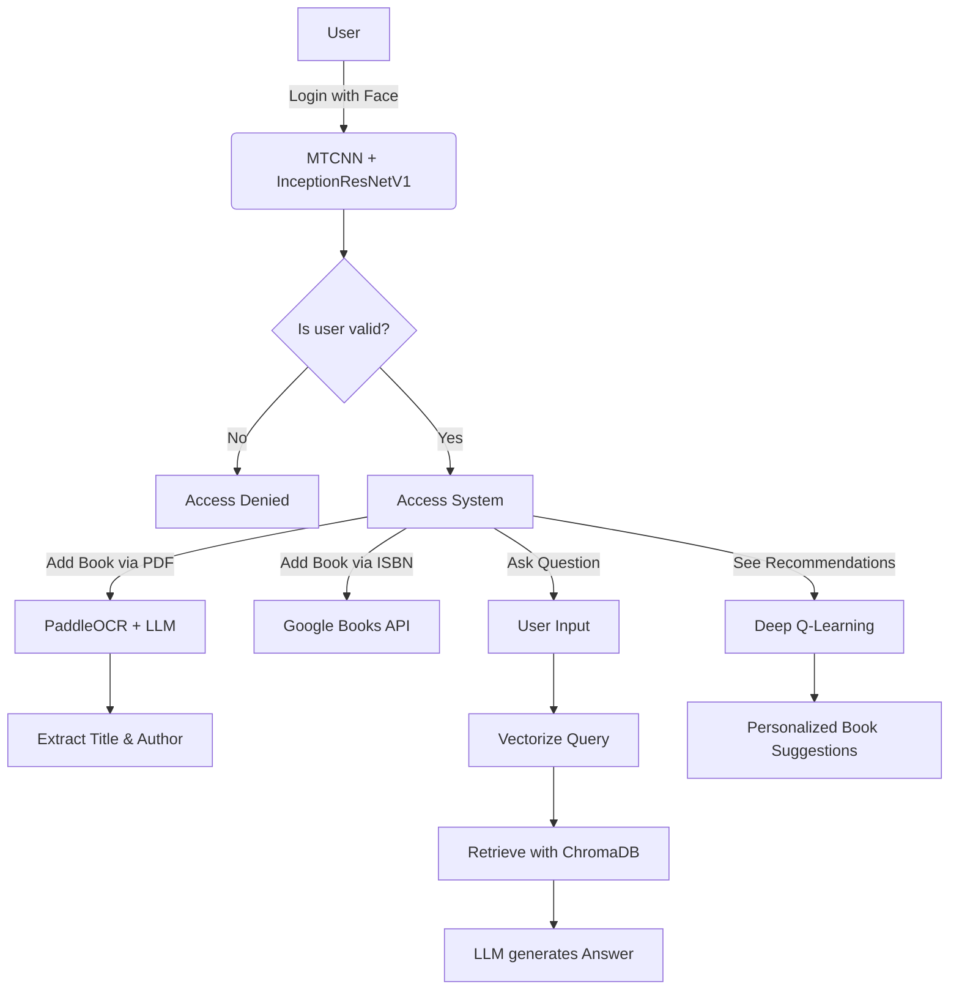

# SMART AI LIBRARY FOR HCMUTE STUDENTS

## Description

The **Smart Library System** is an intelligent platform designed to assist users in managing, searching, and retrieving book-related information using Artificial Intelligence. The system integrates technologies such as OCR (Optical Character Recognition), face recognition, and a chatbot powered by Retrieval-Augmented Generation (RAG) to enhance the user experience in a library setting. It allows users to add books via ISBN scanning or cover image, extract introductions from books, query book content via chatbot, and even log in through facial recognition. This platform supports librarians, students, and readers in accessing and organizing knowledge efficiently.

## 📌 Objective

To build an intelligent library system that enables students to:
- Log in using facial recognition.
- Add new books using book cover images.
- Query book content via AI chatbot.
- Receive personalized book recommendations.

## 🧠 Algorithms and Techniques

### 1. Face Recognition
- **MTCNN**: Detect and align faces.
- **InceptionResNetV1**: Extract 512-dim feature vectors.
- **Cosine Similarity**: Used to match identities.

### 2. Book Information Extraction
- **OCR**: PaddleOCR/VietOCR to extract title/author from images.
- **LLM**: Understand text and classify content.

### 3. AI Chatbot (RAG)
- **RAG (Retrieval-Augmented Generation)**:
  - Retrieve introduction paragraphs via ChromaDB.
  - Generate answers using LLM (Gemma or LLaMA).

### 4. Personalized Book Recommendation
- **Deep Q-Learning**:
  - States: [user_id, (intro+description)_embedded]
  - Actions: recommend books.
  - Reward: based on user interactions (viewed, asked, downloaded). On detailed: f(user_interactions, time, content_book)

## 🤖 Model Fine-Tuned

- **Embedding Model for Chatbot**: Sentence Transformers (e.g., `sentence-transformers/all-MiniLM-L6-v2`)
- **OCR Model**: VietOCR (`vgg_transformer`) for Vietnamese book title recognition
- **Face Recognition**: Dlib-based or InsightFace-based model for facial login

## 💁‍♂️ Features

- **OCR Book Title & Author Recognition**: Extracts titles and author names from scanned book covers using Vietnamese OCR.
- **Book Introduction Extraction**: Automatically extracts the preface/introduction from scanned PDFs using text detection + OCR.
- **Chatbot with Book Knowledge**: Chat with the system to get summarized information or answers based on book introductions.
- **Face Recognition Login**: Users can authenticate via facial recognition, improving convenience and security.
- **ISBN Scanning Support**: Retrieves metadata via ISBN from external APIs.
- **QR Code Scanning**: Alternate login or checkout method using QR codes.

## 👨‍🌾 Data Collection & Processing

1. **OCR Pipeline**:
   - Uses PaddleOCR + VietOCR to extract text from images of book covers.
   - Preprocessing includes noise removal, contrast adjustment, and font thickening for accuracy.

2. **PDF Processing**:
   - Extracts text from scanned books using layout-aware OCR.
   - Saves introduction sections into ChromaDB with embedding vectors.

3. **Face Recognition Data**:
   - User face images are stored as encodings in a vector store to support fast face matching.

## 💪 Model Optimization

1. **OCR Optimization**:
   - Combined PaddleOCR detection + VietOCR recognition for higher Vietnamese OCR accuracy.
   - Fine-tuned detection threshold and line merging postprocessing.

2. **Embedding & Search**:
   - Sentence embeddings indexed in ChromaDB for fast semantic search on book introductions.
   - Supports RAG (Retrieval-Augmented Generation) for chatbot queries.

3. **Face Recognition**:
   - Used Dlib or InsightFace to embed user face images and compare using cosine similarity.
   - Optimized lighting and angle normalization for webcam input.

## 👨‍💻 Deployment

1. **Backend with Flask**:
   - Flask serves REST API endpoints for chatbot, OCR, face login, and book management.

2. **Frontend**:
   - Web interface using HTML/CSS/JS (or optionally Django) with pages for scanning, login, and chatbot queries.

3. **Deployment**:
   - Backend containerized for easy deployment on local machines or servers.
   - Compatible with Nvidia Docker for GPU acceleration in OCR/LLM tasks.

## 🛠️ Technologies Used

| Component         | Technology                           |
|-------------------|---------------------------------------|
| Programming       | Python, HTML/CSS/JS                   |
| Backend           | Django, Flask                         |
| Frontend          | Django Template                       |
| NLP/AI            | LLaMA/Gemma (LLMs), SentenceTransformer |
| OCR               | PaddleOCR, VietOCR                    |
| Vector Search     | ChromaDB                              |
| Database          | SQL Server                            |
| Face Recognition  | MTCNN, InceptionResNetV1              |
| Recommendation    | Deep Q-Learning                       |
| Book API          | Google Books API                      |

## 🖥️ Hardware Requirements

| Component     | Minimum Requirement            |
|---------------|-------------------------------|
| CPU           | Intel Core i5 or better         |
| RAM           | At least 8 GB                  |
| GPU           | Recommended: NVIDIA ≥ 4GB VRAM |
| Storage       | SSD with ≥ 10 GB free space     |
| OS            | Ubuntu 20.04+ or Windows 10+    |

## 🗄️ Database Architecture

### SQL Server (Relational DB)
- `User`: login info, roles (student/librarian).
- `Book`: metadata of books.
- `BookIntro`: extracted book introductions.
- `Chat`: chatbot dialogue logs.
- `UserBookInteraction`: tracks user engagement.

### ChromaDB (Vector DB)
- Stores embeddings of book introductions.
- Enables semantic search and RAG integration.

## 🔁 System Workflow

> **Note**: Font rendering such as Times New Roman must be applied via HTML or PDF stylesheets. Mermaid itself does not allow font-family specification directly.

Click to expand Mermaid diagram (for systems that render it)

## 📊 Performance
### 1. Face Recognition

### 2. Book Information Extraction

### 3. AI Chatbot (RAG)

### 4. Personalized Book Recommendation

